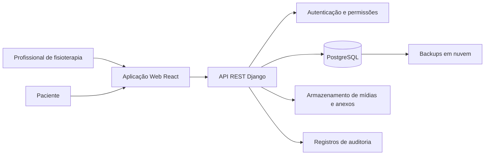
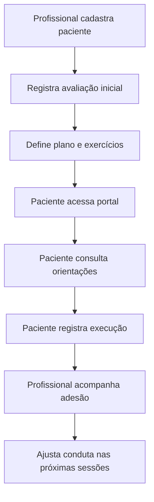
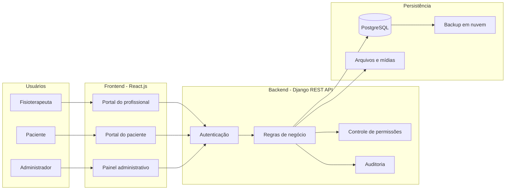
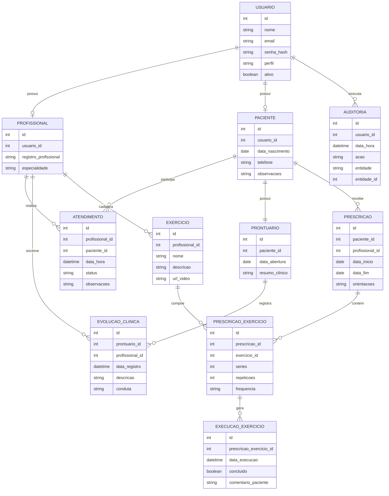

# Sistema Web de Gestão e Acompanhamento Clínico para Fisioterapia

Victor Bury de Araujo

Sistema Web de Gestão e Acompanhamento Clínico para Fisioterapia

Niterói
2026

Victor Bury de Araujo

Sistema Web de Gestão e Acompanhamento Clínico para Fisioterapia

Anteprojeto apresentado ao Centro Universitário La Salle do Rio de Janeiro (UNILASALLE-RJ) como parte dos requisitos para aprovação na disciplina de Projeto Final I do curso de Bacharelado em Sistemas de Informação.

Orientador: Prof. Alexandre Neves Louzada

Niterói
2026

Sistema Web de Gestão e Acompanhamento Clínico para Fisioterapia

Victor Bury de Araujo - 1014702

Anteprojeto apresentado ao Centro Universitário La Salle do Rio de Janeiro (UNILASALLE-RJ) como parte dos requisitos para aprovação na disciplina de Projeto Final I do curso de Bacharelado em Sistemas de Informação.

Banca Examinadora:

1. Orientador e Presidente: Prof. Alexandre Neves Louzada

Niterói
2026

## Resumo

Este anteprojeto propõe o desenvolvimento de um sistema web para gestão e acompanhamento clínico em clínicas de fisioterapia de pequeno porte. A proposta parte da observação de que muitas clínicas utilizam registros manuais, planilhas ou sistemas voltados principalmente à agenda e ao faturamento, o que limita o acompanhamento da evolução clínica e da adesão do paciente aos exercícios domiciliares. O sistema proposto integrará prontuário eletrônico, prescrição de exercícios, agenda clínica e portal do paciente, permitindo que fisioterapeutas registrem atendimentos, acompanhem a progressão do tratamento e disponibilizem orientações estruturadas fora do ambiente presencial. A pesquisa será aplicada, exploratória e de abordagem mista, com desenvolvimento de um protótipo funcional e avaliação por métricas de uso e pelo questionário System Usability Scale (SUS). Espera-se que a solução contribua para melhorar a organização das informações clínicas, ampliar a visibilidade do profissional sobre a continuidade do tratamento e oferecer ao paciente um canal simples para consulta das orientações recebidas.

Palavras-chave: fisioterapia; prontuário eletrônico; sistema web; engajamento do paciente; usabilidade.

## Abstract

This preliminary project proposes the development of a web-based system for clinical management and monitoring in small physiotherapy clinics. The proposal is based on the observation that many clinics still rely on manual records, spreadsheets, or systems mainly focused on scheduling and billing, which limits the monitoring of clinical progress and patient adherence to home exercises. The proposed system will integrate electronic health records, exercise prescription, clinical scheduling, and a patient portal, enabling physiotherapists to register appointments, track treatment progress, and provide structured guidance outside face-to-face sessions. The research will be applied, exploratory, and based on a mixed-method approach, including the development of a functional prototype and evaluation through usage metrics and the System Usability Scale (SUS). The expected contribution is to improve the organization of clinical information, increase the professional's visibility into treatment continuity, and provide patients with a simple channel to access prescribed instructions.

Keywords: physiotherapy; electronic health record; web system; patient engagement; usability.

## Sumário

1. Introdução
   1.1. Motivação
   1.2. Problema
   1.3. Hipótese
   1.4. Objetivos
   1.5. Escopo do Projeto
   1.6. Organização do Trabalho
2. Referencial Teórico
   2.1. Sistemas de Informação em Saúde e Prontuário Eletrônico do Paciente
   2.2. Engajamento do Paciente e Adesão ao Tratamento
   2.3. Experiência do Usuário e Usabilidade em Sistemas Clínicos
   2.4. Tecnologias para Desenvolvimento Web
   2.5. Considerações sobre Segurança e Privacidade de Dados em Saúde
   2.6. Trabalhos Relacionados
3. Planejamento e Metodologia da Solução Proposta
   3.1. Metodologia da Pesquisa
   3.2. Arquitetura da Solução Proposta
   3.3. Modelagem da Solução
      3.3.1. Requisitos Funcionais e Não Funcionais
   3.4. Planejamento Experimental e Validação
   3.5. Cronograma
   3.6. Atividades Realizadas e Entregas Previstas
4. Referências Bibliográficas
5. Apêndice I - Diagrama de Arquitetura
6. Apêndice II - Modelo Inicial de Dados

## Lista de Figuras

Figura 1: Arquitetura proposta para o sistema web.

Figura 2: Fluxo principal de acompanhamento clínico.

## Lista de Tabelas

Tabela 1: Comparativo entre soluções existentes e a proposta.

Tabela 2: Requisitos funcionais do sistema.

Tabela 3: Requisitos não funcionais do sistema.

Tabela 4: Métricas de validação do protótipo.

Tabela 5: Cronograma de atividades.

## Lista de Abreviaturas e Siglas

ABNT - Associação Brasileira de Normas Técnicas.

API - Application Programming Interface.

CFM - Conselho Federal de Medicina.

CREFITO - Conselho Regional de Fisioterapia e Terapia Ocupacional.

CRUD - Create, Read, Update and Delete.

DER - Diagrama Entidade-Relacionamento.

LGPD - Lei Geral de Proteção de Dados Pessoais.

MER - Modelo Entidade-Relacionamento.

MVP - Minimum Viable Product, ou Mínimo Produto Viável.

PEP - Prontuário Eletrônico do Paciente.

PoC - Proof of Concept, ou Prova de Conceito.

REST - Representational State Transfer.

RF - Requisito Funcional.

RNF - Requisito Não Funcional.

SBIS - Sociedade Brasileira de Informática em Saúde.

S-RES - Sistema de Registro Eletrônico de Saúde.

SUS - System Usability Scale.

UML - Unified Modeling Language.

UX - User Experience, ou Experiência do Usuário.

# 1. Introdução

Este capítulo apresenta a visão geral do problema e do trabalho que será elaborado. A seção 1.1 apresenta a motivação para a realização deste estudo. A seção 1.2 descreve o problema de pesquisa. A seção 1.3 apresenta a hipótese levantada. A seção 1.4 define os objetivos geral e específicos. A seção 1.5 delimita o escopo do projeto. Por fim, a seção 1.6 descreve a organização do trabalho.

A prática fisioterapêutica exige acompanhamento contínuo, uma vez que a evolução clínica do paciente não depende apenas dos atendimentos presenciais. Em muitos tratamentos, a realização correta de exercícios domiciliares, o registro da evolução funcional, a comunicação clara das orientações e a organização do histórico clínico influenciam diretamente a continuidade do cuidado. No entanto, clínicas de fisioterapia de pequeno porte nem sempre contam com ferramentas digitais voltadas à gestão clínica, recorrendo a fichas em papel, planilhas, aplicativos de mensagem ou sistemas genéricos.

Os Sistemas de Informação podem apoiar esse contexto ao organizar dados, reduzir retrabalho e permitir que informações relevantes estejam disponíveis no momento da tomada de decisão. Laudon e Laudon (2014) destacam que sistemas de informação são fundamentais para coordenar pessoas, processos e tecnologia em organizações. Na área da saúde, esse papel ganha importância adicional, pois os dados registrados apoiam decisões profissionais, continuidade assistencial e comunicação entre profissional e paciente.

Nesse cenário, este anteprojeto propõe o desenvolvimento de um sistema web para gestão de prontuários, prescrição de exercícios e acompanhamento de pacientes em clínicas de fisioterapia de pequeno porte. A solução busca ir além da gestão administrativa, concentrando-se na jornada clínica do paciente e na necessidade do fisioterapeuta de acompanhar a evolução do tratamento de forma estruturada.

## 1.1. Motivação

A motivação deste trabalho baseia-se na observação de práticas comuns em clínicas de fisioterapia de pequeno porte, nas quais se identificam limitações no acompanhamento clínico decorrentes do uso de registros manuais ou de sistemas voltados predominantemente à agenda e ao controle financeiro. Embora essas ferramentas atendam a necessidades administrativas, elas tendem a oferecer pouco suporte ao acompanhamento da progressão clínica, à prescrição de exercícios domiciliares e à análise da adesão do paciente ao tratamento.

Em tratamentos fisioterapêuticos, a continuidade entre as sessões é um aspecto relevante. O paciente pode receber orientações presenciais, mas, sem um canal organizado para consultar exercícios, registrar execução ou acompanhar metas, há maior chance de perda de informação e baixa adesão. Para o fisioterapeuta, a ausência de registros estruturados dificulta a visualização histórica da evolução, a comparação entre avaliações e a identificação de pacientes que necessitam de reforço de orientação.

A relevância do projeto está em propor uma solução tecnológica alinhada à realidade de clínicas menores, com foco em simplicidade, usabilidade e viabilidade técnica. Em vez de priorizar funcionalidades amplas de gestão empresarial, o sistema proposto concentra-se no núcleo clínico: prontuário eletrônico, prescrição de exercícios, acompanhamento da evolução e comunicação estruturada com o paciente.

## 1.2. Problema

Como apoiar o acompanhamento contínuo e o engajamento de pacientes em clínicas de fisioterapia de pequeno porte por meio de um sistema web de gestão de prontuários e prescrição de exercícios?

## 1.3. Hipótese

A adoção de um sistema web integrado de prontuário eletrônico, prescrição de exercícios e portal do paciente pode melhorar o acompanhamento clínico e favorecer a adesão ao tratamento fisioterapêutico, o que poderá ser observado por meio de métricas como frequência de acesso ao portal, taxa de visualização e conclusão dos exercícios prescritos, regularidade dos registros clínicos e avaliação de usabilidade pelo questionário SUS.

## 1.4. Objetivos

### 1.4.1. Objetivo Geral

Desenvolver um sistema web para gestão de prontuários, acompanhamento de progressão clínica e prescrição de exercícios, aplicado ao contexto de clínicas de fisioterapia de pequeno porte da região de Niterói (RJ).

### 1.4.2. Objetivos Específicos

- Analisar os processos atuais de registro clínico, agendamento e acompanhamento domiciliar em clínicas de fisioterapia.
- Levantar requisitos funcionais e não funcionais para um sistema de acompanhamento clínico voltado a fisioterapeutas e pacientes.
- Modelar a arquitetura da solução, os principais fluxos de uso e o banco de dados relacional.
- Implementar um MVP com módulos de autenticação, cadastro de pacientes, agenda, prontuário eletrônico, prescrição de exercícios e portal do paciente.
- Definir critérios de segurança, privacidade e controle de acesso compatíveis com o tratamento de dados de saúde.
- Avaliar a usabilidade do protótipo por meio de testes de interação com usuários e aplicação do questionário System Usability Scale (SUS).

## 1.5. Escopo do Projeto

O escopo inicial do projeto será limitado ao desenvolvimento de um MVP funcional, voltado ao uso por profissionais de fisioterapia e seus pacientes. O sistema não terá como objetivo substituir a avaliação profissional, emitir diagnóstico automatizado ou realizar tomada de decisão clínica autônoma. Sua função será apoiar o registro, a organização, a consulta e o acompanhamento das informações produzidas pelo fisioterapeuta.

O módulo do profissional contemplará cadastro de pacientes, agenda de atendimentos, prontuário evolutivo, registro de avaliações, prescrição de exercícios e acompanhamento da execução das atividades. O módulo do paciente permitirá acesso restrito às orientações prescritas, visualização dos exercícios, registro simples de execução e consulta ao histórico disponibilizado pelo profissional.

Ficam fora do escopo inicial funcionalidades como faturamento, integração com operadoras de saúde, teleatendimento completo, gateway de pagamento, prescrição automatizada por inteligência artificial e interoperabilidade com outros sistemas clínicos. Tais funcionalidades poderão ser consideradas em trabalhos futuros, após a validação do MVP.

## 1.6. Organização do Trabalho

Este trabalho está organizado em três capítulos principais. O Capítulo 1 apresenta a introdução, a motivação, o problema, a hipótese, os objetivos e o escopo. O Capítulo 2 apresenta o referencial teórico, abordando Sistemas de Informação em Saúde, prontuário eletrônico, engajamento do paciente, usabilidade e segurança de dados em saúde. O Capítulo 3 descreve a metodologia, a arquitetura proposta, a modelagem da solução, os critérios de validação e o cronograma de desenvolvimento.

# 2. Referencial Teórico

Este capítulo apresenta a fundamentação científica e tecnológica necessária para sustentar a proposta. A seção 2.1 aborda Sistemas de Informação em Saúde e o Prontuário Eletrônico do Paciente. A seção 2.2 discute o engajamento do paciente e a adesão ao tratamento. A seção 2.3 apresenta conceitos de experiência do usuário e usabilidade em sistemas clínicos. A seção 2.4 descreve tecnologias relacionadas ao desenvolvimento web. A seção 2.5 apresenta considerações sobre segurança e privacidade de dados em saúde. Por fim, a seção 2.6 analisa trabalhos e soluções relacionadas, posicionando a proposta diante das alternativas existentes.

## 2.1. Sistemas de Informação em Saúde e Prontuário Eletrônico do Paciente

Sistemas de Informação são conjuntos organizados de componentes que coletam, processam, armazenam e distribuem informações para apoiar decisões e atividades organizacionais (LAUDON; LAUDON, 2014). Em organizações de saúde, esses sistemas assumem papel estratégico porque lidam com informações sensíveis e diretamente relacionadas à qualidade do atendimento, à continuidade assistencial e à eficiência operacional.

O Prontuário Eletrônico do Paciente (PEP) representa uma das aplicações mais relevantes dos Sistemas de Informação em Saúde. Segundo Massad, Marin e Azevedo Neto (2003), o prontuário eletrônico contribui para registrar, recuperar e organizar informações clínicas, permitindo que dados do paciente sejam utilizados de forma mais eficiente no cuidado. Diferentemente do prontuário em papel, o PEP possibilita busca estruturada, padronização de registros, redução de perdas físicas e maior facilidade de análise histórica.

No contexto da fisioterapia, o prontuário deve registrar informações como avaliação inicial, queixa principal, evolução funcional, condutas aplicadas, orientações prescritas e resposta do paciente ao tratamento. A digitalização desses registros pode favorecer a continuidade do cuidado, especialmente quando associada a funcionalidades de acompanhamento fora da sessão presencial.

Entretanto, sistemas que armazenam dados de saúde precisam observar requisitos de segurança, privacidade e controle de acesso. A Sociedade Brasileira de Informática em Saúde (SBIS) define Sistemas de Registro Eletrônico de Saúde como sistemas capazes de capturar, armazenar, apresentar, transmitir ou imprimir informação identificada em saúde, e sua certificação avalia aspectos de qualidade, segurança, privacidade e aderência a regulamentações (SBIS, 2026). Ainda que o MVP deste trabalho não tenha como objetivo obter certificação formal, seus requisitos serão utilizados como referência para boas práticas.

## 2.2. Engajamento do Paciente e Adesão ao Tratamento

A adesão ao tratamento é um dos desafios recorrentes na área da saúde. A Organização Mundial da Saúde (2003) aponta que a adesão a terapias de longo prazo é influenciada por múltiplos fatores, incluindo características do paciente, do tratamento, da condição de saúde, do sistema de saúde e do contexto socioeconômico. Embora o relatório seja voltado a terapias prolongadas em geral, sua lógica é aplicável ao contexto fisioterapêutico, em que a continuidade das orientações entre as sessões presenciais pode interferir nos resultados.

Na fisioterapia, a execução de exercícios domiciliares depende de compreensão, motivação, rotina e acompanhamento. Quando o paciente não dispõe de instruções claras ou esquece a forma correta de execução, a adesão tende a diminuir. Da mesma forma, quando o profissional não possui informações sobre a execução das atividades fora da clínica, torna-se mais difícil ajustar o plano terapêutico com base na realidade do paciente.

O engajamento do paciente envolve participação ativa, acesso à informação e corresponsabilidade no cuidado. Ferramentas digitais, quando bem projetadas, podem apoiar esse processo ao disponibilizar orientações, lembretes, histórico de atividades e canais de acompanhamento. No projeto proposto, o portal do paciente tem justamente a função de reduzir a dependência de instruções verbais isoladas e oferecer ao usuário um ambiente simples para consultar exercícios e registrar sua execução.

## 2.3. Experiência do Usuário e Usabilidade em Sistemas Clínicos

A experiência do usuário (UX) refere-se à forma como uma pessoa percebe e interage com um produto, serviço ou sistema. Em sistemas clínicos, a usabilidade é especialmente importante porque interfaces confusas podem aumentar o tempo de atendimento, gerar erros de registro e dificultar a adoção da ferramenta por profissionais e pacientes.

Nielsen (1993) destaca que a usabilidade envolve atributos como facilidade de aprendizado, eficiência, memorização, prevenção de erros e satisfação. Em um sistema para fisioterapia, esses atributos devem estar presentes tanto no módulo profissional quanto no módulo do paciente. O fisioterapeuta precisa registrar informações rapidamente durante ou após o atendimento, enquanto o paciente precisa compreender orientações sem depender de conhecimento técnico.

Para avaliação do protótipo, será utilizada a System Usability Scale (SUS), proposta por Brooke (1996). A SUS é um questionário de dez itens com escala Likert de cinco pontos, amplamente utilizado para obter uma medida geral de usabilidade percebida. Sua aplicação é adequada ao contexto deste trabalho por ser simples, de baixo custo e compatível com avaliação de protótipos.

Além da SUS, poderão ser observados indicadores práticos, como tempo para concluir tarefas, número de erros durante a navegação e comentários qualitativos dos participantes. Essa combinação permite avaliar não apenas a percepção subjetiva dos usuários, mas também problemas concretos de interação.

## 2.4. Tecnologias para Desenvolvimento Web

O sistema proposto será desenvolvido como aplicação web, pois esse formato facilita o acesso por diferentes dispositivos e reduz a necessidade de instalação local. A arquitetura seguirá o padrão cliente-servidor, com separação entre interface, lógica de negócio e persistência de dados.

No frontend, será utilizado React.js, biblioteca JavaScript voltada à construção de interfaces interativas e componentizadas. Essa escolha permite criar telas responsivas para profissionais e pacientes, favorecendo reuso de componentes e evolução gradual do MVP. No backend, será utilizado Python com Django e Django REST Framework, por oferecer recursos maduros de autenticação, modelagem de dados, painel administrativo, segurança e construção de APIs REST. Para persistência, será utilizado PostgreSQL, banco de dados relacional adequado para informações estruturadas, relacionamentos entre entidades e integridade transacional.

A implantação será planejada em ambiente de nuvem, o que simplifica a disponibilidade do sistema durante os testes, facilita backups e evita dependência de infraestrutura física dentro da clínica. Essa decisão também melhora a viabilidade do projeto dentro do período de Projeto Final I e Projeto Final II.

## 2.5. Considerações sobre Segurança e Privacidade de Dados em Saúde

Dados de saúde são dados pessoais sensíveis nos termos da Lei Geral de Proteção de Dados Pessoais (LGPD), Lei nº 13.709/2018. Isso exige que o sistema adote medidas de segurança e privacidade desde sua concepção, considerando princípios como finalidade, necessidade, adequação, transparência e segurança.

No MVP, as principais medidas previstas são autenticação de usuários, separação de perfis de acesso, criptografia de senhas, controle de sessões, registros de auditoria para ações relevantes, backups e restrição de acesso aos prontuários apenas aos profissionais autorizados e ao próprio paciente quando aplicável. Também será evitada a coleta de dados que não sejam necessários ao objetivo do sistema.

As recomendações da SBIS e do CFM sobre Sistemas de Registro Eletrônico de Saúde serão utilizadas como referência conceitual para orientar decisões técnicas, especialmente no que se refere a segurança da informação, privacidade, integridade dos registros e rastreabilidade.

## 2.6. Trabalhos Relacionados

O mercado dispõe de soluções que tangenciam o problema tratado neste trabalho, geralmente organizadas em duas categorias. A primeira reúne sistemas comerciais de gestão de clínicas, como iClinic e Feegow Clinic, voltados sobretudo à agenda, ao prontuário genérico, ao faturamento e ao controle financeiro. Essas plataformas atendem bem à dimensão administrativa, mas oferecem pouco suporte específico à prescrição de exercícios e ao acompanhamento da adesão domiciliar característico da fisioterapia. A segunda categoria reúne plataformas especializadas em prescrição de exercícios, como Physitrack e Vedius, que disponibilizam bibliotecas de exercícios em vídeo e aplicativos para o paciente, porém, em geral, possuem custo elevado para clínicas de pequeno porte e nem sempre integram, em um único ambiente, prontuário evolutivo, agenda e portal do paciente.

A análise dessas soluções evidencia uma lacuna para clínicas de pequeno porte: a ausência de uma ferramenta enxuta que articule, de forma integrada e de baixo custo, o núcleo clínico (prontuário evolutivo), a prescrição estruturada de exercícios e um portal simples para acompanhamento da execução pelo paciente. A proposta deste trabalho posiciona-se justamente nesse espaço, priorizando simplicidade, usabilidade e viabilidade técnica em vez da amplitude funcional dos sistemas de gestão empresarial. A Tabela 1 sintetiza a comparação entre as categorias de soluções existentes e a proposta.

Tabela 1: Comparativo entre soluções existentes e a proposta.

| Característica | Sistemas de gestão clínica | Plataformas de prescrição de exercícios | Proposta deste trabalho |
|---|---|---|---|
| Prontuário eletrônico evolutivo | Sim (genérico) | Parcial | Sim (focado em fisioterapia) |
| Prescrição estruturada de exercícios | Não ou limitada | Sim | Sim |
| Portal do paciente com registro de execução | Raro | Sim | Sim |
| Agenda clínica integrada | Sim | Parcial | Sim |
| Foco em clínicas de pequeno porte | Parcial | Não | Sim |
| Custo acessível | Variável | Elevado | Direcionado a baixo custo |

Este comparativo não pretende esgotar o conjunto de ferramentas disponíveis, mas demonstrar que a proposta não concorre diretamente com grandes plataformas, e sim atende a um nicho com necessidades específicas ainda pouco contempladas de forma integrada.

# 3. Planejamento e Metodologia da Solução Proposta

Este capítulo apresenta o planejamento metodológico e técnico da solução proposta. A seção 3.1 descreve a natureza da pesquisa e a estratégia metodológica. A seção 3.2 apresenta a arquitetura do sistema. A seção 3.3 descreve a modelagem inicial da solução. A seção 3.4 apresenta o planejamento experimental e os critérios de validação. A seção 3.5 mostra o cronograma. Por fim, a seção 3.6 sintetiza as atividades realizadas e as entregas previstas.

## 3.1. Metodologia da Pesquisa

Este trabalho caracteriza-se como uma pesquisa aplicada, pois busca desenvolver uma solução prática para um problema identificado no contexto de clínicas de fisioterapia de pequeno porte. A pesquisa também possui caráter exploratório, uma vez que busca compreender necessidades de usuários e validar uma proposta de sistema em estágio inicial. Quanto à abordagem, será adotada uma perspectiva mista, combinando dados qualitativos, obtidos por observação e feedback dos usuários, com dados quantitativos, obtidos por métricas de uso e questionários de usabilidade.

Do ponto de vista técnico, a estratégia metodológica será baseada no desenvolvimento de uma Prova de Conceito (PoC) e de um MVP funcional. Inicialmente, serão levantados requisitos com base em observação de processos clínicos, análise de sistemas semelhantes e revisão bibliográfica. Em seguida, serão elaborados diagramas de arquitetura, fluxos de uso e modelo de dados. Após essa etapa, será desenvolvido o protótipo com os módulos essenciais.

O desenvolvimento será organizado em ciclos incrementais. Cada ciclo contemplará planejamento de funcionalidades, implementação, testes locais e ajustes. Ao final, o protótipo será avaliado com usuários representativos, incluindo profissionais de fisioterapia e, se possível, pacientes convidados. A validação envolverá execução de tarefas, coleta de métricas de uso, aplicação da escala SUS e análise de comentários qualitativos.

## 3.2. Arquitetura da Solução Proposta

A arquitetura proposta será baseada em nuvem e seguirá o padrão cliente-servidor. O frontend será responsável pela interface do usuário, oferecendo telas para o profissional e para o paciente. O backend fornecerá uma API REST para autenticação, regras de negócio, controle de permissões, registro de prontuários, prescrição de exercícios e consulta de informações. O banco de dados PostgreSQL armazenará dados estruturados, como usuários, pacientes, atendimentos, evoluções clínicas, exercícios e registros de execução.

A Figura 1 representa a arquitetura proposta.

O fluxo principal de uso será composto por autenticação, cadastro do paciente, registro de avaliação ou evolução, prescrição de exercícios e acompanhamento da execução pelo paciente. A Figura 2 apresenta esse fluxo em nível conceitual.

Essa arquitetura foi escolhida por ser compatível com o tempo de desenvolvimento do projeto, por permitir implantação gradual e por reduzir a complexidade operacional em comparação com soluções híbridas ou totalmente locais.

## 3.3. Modelagem da Solução

A modelagem inicial será composta por diagramas UML e por um modelo de dados relacional. Os principais atores do sistema são o fisioterapeuta, o paciente e o administrador. O fisioterapeuta poderá cadastrar pacientes, registrar atendimentos, prescrever exercícios e acompanhar relatórios. O paciente poderá acessar seu portal, visualizar exercícios e registrar execução. O administrador poderá gerenciar usuários e parâmetros básicos do sistema.

Principais casos de uso:

- Realizar login no sistema.
- Cadastrar e editar dados do paciente.
- Agendar atendimento.
- Registrar avaliação inicial.
- Registrar evolução clínica.
- Prescrever exercícios.
- Consultar histórico do paciente.
- Acessar portal do paciente.
- Visualizar exercícios prescritos.
- Registrar execução de exercícios.
- Gerar indicadores de acompanhamento.

O modelo inicial de dados será composto pelas seguintes entidades:

- Usuário: representa contas de acesso ao sistema.
- Profissional: armazena dados específicos do fisioterapeuta.
- Paciente: armazena dados cadastrais e informações clínicas básicas.
- Atendimento: representa sessões agendadas ou realizadas.
- Prontuário: agrupa registros clínicos do paciente.
- Evolução Clínica: registra anotações de progresso e condutas.
- Exercício: representa exercícios cadastrados pelo profissional.
- Prescrição: associa exercícios a um paciente em determinado período.
- Execução de Exercício: registra retorno do paciente sobre a realização das atividades.
- Auditoria: registra ações relevantes para rastreabilidade.

O Apêndice II apresenta um modelo inicial em formato DER.

### 3.3.1. Requisitos Funcionais e Não Funcionais

A partir dos casos de uso e do modelo de dados, foram levantados os requisitos preliminares que orientarão a implementação do MVP. Os requisitos funcionais (RF) descrevem as funcionalidades que o sistema deve oferecer, enquanto os requisitos não funcionais (RNF) estabelecem restrições de qualidade, segurança e desempenho. A Tabela 2 apresenta os requisitos funcionais e a Tabela 3 os requisitos não funcionais.

Tabela 2: Requisitos funcionais do sistema.

| ID | Requisito funcional | Prioridade |
|---|---|---|
| RF01 | Autenticar usuários com controle de perfis (profissional, paciente e administrador). | Alta |
| RF02 | Permitir o cadastro e a edição de dados de pacientes. | Alta |
| RF03 | Permitir o agendamento e a consulta de atendimentos. | Média |
| RF04 | Registrar avaliação inicial e evoluções clínicas no prontuário. | Alta |
| RF05 | Cadastrar exercícios e criar prescrições associadas a um paciente. | Alta |
| RF06 | Disponibilizar portal do paciente para consulta dos exercícios prescritos. | Alta |
| RF07 | Permitir ao paciente registrar a execução dos exercícios. | Alta |
| RF08 | Consultar o histórico clínico e os registros de execução do paciente. | Média |
| RF09 | Gerar indicadores de acompanhamento e adesão. | Média |
| RF10 | Registrar em auditoria as ações relevantes realizadas no sistema. | Média |

Tabela 3: Requisitos não funcionais do sistema.

| ID | Requisito não funcional |
|---|---|
| RNF01 | O sistema deve ser uma aplicação web acessível por navegadores em diferentes dispositivos. |
| RNF02 | As senhas devem ser armazenadas com criptografia (hash) e o acesso deve respeitar os perfis definidos. |
| RNF03 | O sistema deve observar os princípios da LGPD no tratamento de dados pessoais sensíveis. |
| RNF04 | As telas principais devem responder em tempo adequado ao uso cotidiano. |
| RNF05 | A interface deve seguir critérios de usabilidade, com pontuação SUS igual ou superior a 68. |
| RNF06 | O sistema deve manter registros de auditoria e backups periódicos dos dados. |
| RNF07 | A arquitetura deve permitir implantação em ambiente de nuvem. |

## 3.4. Planejamento Experimental e Validação

A validação buscará verificar se o protótipo é funcional, compreensível e adequado ao contexto proposto. A avaliação será realizada em ambiente controlado, com usuários convidados, por meio da execução de tarefas representativas.

Tarefas previstas para profissionais:

- cadastrar um paciente;
- registrar uma avaliação inicial;
- criar uma prescrição de exercícios;
- consultar o histórico clínico;
- verificar registros de execução do paciente.

Tarefas previstas para pacientes:

- acessar o portal;
- visualizar exercícios prescritos;
- consultar orientações;
- registrar execução de exercício;
- verificar informações básicas do acompanhamento.

Tabela 4: Métricas de validação do protótipo.

| Critério | Métrica | Forma de coleta | Resultado esperado |
|---|---|---|---|
| Usabilidade percebida | Pontuação SUS | Questionário pós-teste | Pontuação igual ou superior a 68 |
| Eficiência | Tempo para concluir tarefas | Observação durante teste | Conclusão sem auxílio excessivo |
| Facilidade de uso | Número de erros por tarefa | Observação durante teste | Redução de erros após ajustes |
| Engajamento | Acessos ao portal do paciente | Logs do sistema | Uso recorrente durante o período de teste |
| Adesão | Taxa de exercícios marcados como executados | Registros do paciente | Evidência de acompanhamento domiciliar |
| Desempenho | Tempo de resposta das telas principais | Testes técnicos | Respostas em tempo aceitável para uso cotidiano |

A hipótese será considerada parcialmente sustentada caso o protótipo apresente boa aceitação de usabilidade, permita ao profissional acompanhar registros clínicos e gere evidências de interação do paciente com as prescrições. Como se trata de um anteprojeto, não se pretende comprovar impacto clínico definitivo, mas validar a viabilidade técnica e a adequação inicial da solução.

## 3.5. Cronograma

Tabela 5: Cronograma de atividades.

| Etapa | Mês 1 | Mês 2 | Mês 3 | Mês 4 | Mês 5 |
|---|---|---|---|---|---|
| Revisão bibliográfica | X | X |  |  |  |
| Levantamento de requisitos | X | X |  |  |  |
| Modelagem UML e DER |  | X | X |  |  |
| Definição da arquitetura |  | X |  |  |  |
| Desenvolvimento do frontend |  |  | X | X |  |
| Desenvolvimento do backend |  |  | X | X |  |
| Integração do MVP |  |  |  | X |  |
| Testes funcionais |  |  |  | X | X |
| Avaliação com usuários e SUS |  |  |  |  | X |
| Análise dos resultados |  |  |  |  | X |
| Redação final e ajustes ABNT | X | X | X | X | X |
| Preparação para defesa |  |  |  |  | X |

## 3.6. Atividades Realizadas e Entregas Previstas

Até o momento, foram definidos o tema do projeto, o problema de pesquisa, a hipótese, os objetivos, o escopo do MVP e a arquitetura preliminar. Também foram identificadas as principais áreas do referencial teórico: Sistemas de Informação em Saúde, prontuário eletrônico, engajamento do paciente, usabilidade e segurança de dados sensíveis.

As próximas entregas previstas são:

- refinamento dos requisitos funcionais e não funcionais;
- elaboração dos diagramas UML completos;
- detalhamento do DER;
- criação dos protótipos de tela;
- implementação dos módulos essenciais;
- implantação em ambiente de teste;
- execução dos testes com usuários;
- análise dos dados coletados;
- finalização do documento conforme normas acadêmicas.

# 4. Referências Bibliográficas

BRASIL. Lei nº 13.709, de 14 de agosto de 2018. Lei Geral de Proteção de Dados Pessoais (LGPD). Brasília, DF: Presidência da República, 2018. Disponível em: https://www.planalto.gov.br/ccivil_03/_ato2015-2018/2018/lei/l13709compilado.htm. Acesso em: 4 jun. 2026.

BROOKE, John. SUS: a quick and dirty usability scale. In: JORDAN, Patrick W.; THOMAS, Bruce; MCCLELLAND, Ian L.; WEERDMEESTER, Bernard (org.). Usability evaluation in industry. London: Taylor & Francis, 1996. p. 189-194.

DIAS, Donaldo de Souza; SILVA, Mônica Ferreira da. Como escrever uma monografia. Rio de Janeiro: UFRJ/COPPEAD, 2009. (Relatórios COPPEAD, 384).

FIELDING, Roy Thomas. Architectural styles and the design of network-based software architectures. 2000. Tese (Doutorado em Information and Computer Science) - University of California, Irvine, 2000.

LAUDON, Kenneth C.; LAUDON, Jane P. Sistemas de informação gerenciais. 11. ed. São Paulo: Pearson, 2014.

MASSAD, Eduardo; MARIN, Heimar de Fátima; AZEVEDO NETO, Raymundo Soares de (org.). O prontuário eletrônico do paciente na assistência, informação e conhecimento médico. São Paulo: OPAS/OMS, 2003.

NIELSEN, Jakob. Usability engineering. San Francisco: Morgan Kaufmann, 1993.

SBIS. Certificação de Software. Sociedade Brasileira de Informática em Saúde, 2026. Disponível em: https://sbis.org.br/certificacoes/certificacao-software/. Acesso em: 4 jun. 2026.

SBIS. Manuais e listas de requisitos. Sociedade Brasileira de Informática em Saúde, 2026. Disponível em: https://sbis.org.br/certificacoes/certificacao-software/manuais-e-listas-de-requisitos/. Acesso em: 4 jun. 2026.

WORLD HEALTH ORGANIZATION. Adherence to long-term therapies: evidence for action. Geneva: World Health Organization, 2003. Disponível em: https://www.paho.org/en/documents/who-adherence-long-term-therapies-evidence-action-2003. Acesso em: 4 jun. 2026.

# 5. Apêndice I - Diagrama de Arquitetura

O diagrama abaixo poderá ser recriado em ferramenta visual, como Draw.io, Lucidchart ou similar, para inserção no documento final em Word.

# 6. Apêndice II - Modelo Inicial de Dados

